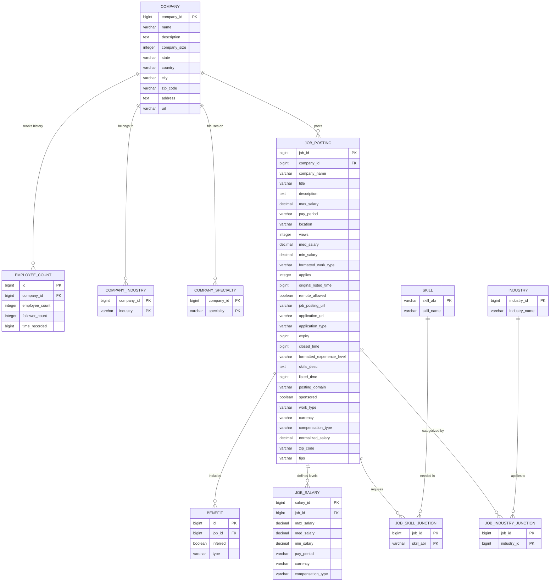

# Job Market Intelligence Platform - Database Model Design

This document details the relational database schema designed for the Job Market Intelligence Data Platform. The design maps raw CSV data from the `core/data/raw/` directory into highly normalized, indexed, and query-optimized structures.

---

## 1. Entity Relationship Overview

The diagram below visualizes the primary tables, their fields, and the foreign key linkages establishing many-to-one, one-to-many, and many-to-many relationships.



---

## 2. Core Models Specification

### 2.1 Company Model (`companies.csv`)
Represents corporate entities hosting job openings on the platform.

| Field Name | SQL Type | Key | Nullable | Description |
| :--- | :--- | :---: | :---: | :--- |
| `company_id` | `BIGINT` | `PK` | No | Unique identifier for each company (mapped from LinkedIn's company page ID). |
| `name` | `VARCHAR(255)` | | No | Name of the corporate organization. |
| `description` | `TEXT` | | Yes | Company profile overview, history, and mission statement. |
| `company_size` | `INTEGER` | | Yes | Category indicating employee range size (e.g. 1 to 8 scale). |
| `state` | `VARCHAR(100)` | | Yes | State abbreviation or region name. |
| `country` | `VARCHAR(100)` | | Yes | Country code or country name (e.g., 'US'). |
| `city` | `VARCHAR(255)` | | Yes | Headquarters city address. |
| `zip_code` | `VARCHAR(20)` | | Yes | Postal/Zip code of headquarters. |
| `address` | `TEXT` | | Yes | Street address. |
| `url` | `VARCHAR(500)` | | Yes | Corporate website link. |

* **Index Recommendation**: Index on `name` (B-tree) for quick searches and prefix matching.

---

### 2.2 Job Posting Model (`postings.csv`)
Represents individual job listings with metadata, compensation, and workflow details.

| Field Name | SQL Type | Key | Nullable | Description |
| :--- | :--- | :---: | :---: | :--- |
| `job_id` | `BIGINT` | `PK` | No | Unique identifier for the posting. |
| `company_id` | `BIGINT` | `FK` | Yes | Foreign key targeting `Company.company_id`. Cascade: `SET NULL`. |
| `company_name` | `VARCHAR(255)` | | Yes | Denormalized fallback company name (if `company_id` is missing). |
| `title` | `VARCHAR(255)` | | No | Title of the position (e.g. "Software Engineer"). |
| `description` | `TEXT` | | No | Full HTML/Markdown description of the job duties and qualifications. |
| `max_salary` | `DECIMAL(12,2)`| | Yes | Maximum stated salary range. |
| `med_salary` | `DECIMAL(12,2)`| | Yes | Median stated salary range (used when single estimate provided). |
| `min_salary` | `DECIMAL(12,2)`| | Yes | Minimum stated salary range. |
| `pay_period` | `VARCHAR(50)` | | Yes | e.g. `HOURLY`, `WEEKLY`, `MONTHLY`, `YEARLY`. |
| `location` | `VARCHAR(255)` | | Yes | Location string (e.g. "New York, NY", "Remote"). |
| `views` | `INTEGER` | | Yes | Total page views logged on platform. |
| `applies` | `INTEGER` | | Yes | Total applications submitted through the posting. |
| `original_listed_time`| `BIGINT` | | Yes | Original creation epoch millisecond timestamp. |
| `listed_time` | `BIGINT` | | Yes | Active listing epoch millisecond timestamp. |
| `expiry` | `BIGINT` | | Yes | Expiration epoch millisecond timestamp. |
| `closed_time` | `BIGINT` | | Yes | Deactivation epoch millisecond timestamp. |
| `remote_allowed` | `BOOLEAN` | | Yes | Standard flag denoting if role supports working remotely. |
| `job_posting_url` | `VARCHAR(500)` | | Yes | Direct link to primary job webpage. |
| `application_url` | `VARCHAR(500)` | | Yes | Third-party application gateway link. |
| `application_type` | `VARCHAR(100)` | | Yes | Type of application flow (e.g., `ComplexOnsiteApply`). |
| `formatted_work_type` | `VARCHAR(100)`| | Yes | Display-friendly work type (e.g., `Full-time`, `Contract`). |
| `work_type` | `VARCHAR(50)` | | Yes | Backend code representing work type (e.g. `FULL_TIME`). |
| `formatted_experience_level` | `VARCHAR(100)` | | Yes | Experience level (e.g. `Mid-Senior level`, `Associate`). |
| `skills_desc` | `TEXT` | | Yes | Free-form summary of required skills and credentials. |
| `posting_domain` | `VARCHAR(255)` | | Yes | Domain of application link. |
| `sponsored` | `BOOLEAN` | | Yes | Flag for paid ad promotion status. |
| `currency` | `VARCHAR(3)` | | Yes | Three-letter currency code (e.g. `USD`). |
| `compensation_type` | `VARCHAR(50)` | | Yes | Type of compensation structure (e.g., `BASE_SALARY`). |
| `normalized_salary` | `DECIMAL(12,2)`| | Yes | Annualized, standard USD salary rate calculated for analysis. |
| `zip_code` | `VARCHAR(20)` | | Yes | Location zip code. |
| `fips` | `VARCHAR(10)` | | Yes | County code mapping (Federal Information Processing Standard). |

* **Index Recommendations**:
  - `company_id` (Foreign key index).
  - `normalized_salary` (B-tree) for compensation filtering.
  - Full-Text Search (FTS) index on `title` and `description` to enable keyword querying.
  - Composite index on (`location`, `remote_allowed`).

---

### 2.3 Industry Model (`industries.csv`)
Master category lookup table for job industries.

| Field Name | SQL Type | Key | Nullable | Description |
| :--- | :--- | :---: | :---: | :--- |
| `industry_id` | `BIGINT` | `PK` | No | Unique identifier for the industry. |
| `industry_name` | `VARCHAR(255)` | | No | Human-readable name (e.g. "Defense and Space Manufacturing"). |

---

### 2.4 Skill Model (`skills.csv`)
Master skill classification lookup table.

| Field Name | SQL Type | Key | Nullable | Description |
| :--- | :--- | :---: | :---: | :--- |
| `skill_abr` | `VARCHAR(10)` | `PK` | No | Short code acronym mapping to skill name (e.g., `DSGN` for Design). |
| `skill_name` | `VARCHAR(150)` | | No | Complete name of the skill. |

---

## 3. Supplementary & Junction Models

### 3.1 Job Skill Junction (`job_skills.csv`)
Many-to-many relationship mapping skills to job postings.

| Field Name | SQL Type | Key | Nullable | Description |
| :--- | :--- | :---: | :---: | :--- |
| `job_id` | `BIGINT` | `PK, FK`| No | References `JobPosting.job_id`. Cascade: `CASCADE`. |
| `skill_abr` | `VARCHAR(10)` | `PK, FK`| No | References `Skill.skill_abr`. Cascade: `CASCADE`. |

---

### 3.2 Job Industry Junction (`job_industries.csv`)
Many-to-many relationship mapping industries to job postings.

| Field Name | SQL Type | Key | Nullable | Description |
| :--- | :--- | :---: | :---: | :--- |
| `job_id` | `BIGINT` | `PK, FK`| No | References `JobPosting.job_id`. Cascade: `CASCADE`. |
| `industry_id` | `BIGINT` | `PK, FK`| No | References `Industry.industry_id`. Cascade: `CASCADE`. |

---

### 3.3 Company Industry Junction (`company_industries.csv`)
Junction table tracking which industries companies operate in.

| Field Name | SQL Type | Key | Nullable | Description |
| :--- | :--- | :---: | :---: | :--- |
| `company_id` | `BIGINT` | `PK, FK`| No | References `Company.company_id`. Cascade: `CASCADE`. |
| `industry` | `VARCHAR(255)` | `PK` | No | Name of the industry. |

---

### 3.4 Company Specialty (`company_specialities.csv`)
Multi-valued list of niche business specialities linked to companies.

| Field Name | SQL Type | Key | Nullable | Description |
| :--- | :--- | :---: | :---: | :--- |
| `company_id` | `BIGINT` | `PK, FK`| No | References `Company.company_id`. Cascade: `CASCADE`. |
| `speciality` | `VARCHAR(255)` | `PK` | No | The specialty tag (e.g. "window replacement"). |

---

### 3.5 Employee Count History (`employee_counts.csv`)
Logs historic organizational changes in employee sizes and social follower growth.

| Field Name | SQL Type | Key | Nullable | Description |
| :--- | :--- | :---: | :---: | :--- |
| `id` | `BIGINT` | `PK` | No | Auto-incrementing identifier. |
| `company_id` | `BIGINT` | `FK` | No | References `Company.company_id`. Cascade: `CASCADE`. |
| `employee_count` | `INTEGER` | | No | Active headcount at record timestamp. |
| `follower_count` | `INTEGER` | | No | Total LinkedIn page followers at record timestamp. |
| `time_recorded` | `BIGINT` | | No | Epoch second timestamp of count. |

* **Index Recommendation**: Index on (`company_id`, `time_recorded` DESC) to retrieve the most recent headcount statistics instantly.

---

### 3.6 Benefits Model (`benefits.csv`)
Listing of employee allowances, health benefits, and compensation options.

| Field Name | SQL Type | Key | Nullable | Description |
| :--- | :--- | :---: | :---: | :--- |
| `id` | `BIGINT` | `PK` | No | Auto-incrementing identifier. |
| `job_id` | `BIGINT` | `FK` | No | References `JobPosting.job_id`. Cascade: `CASCADE`. |
| `inferred` | `BOOLEAN` | | No | Flag indicating if benefit was predicted by text mining (`True`) or explicitly listed (`False`). |
| `type` | `VARCHAR(255)` | | No | The benefit tag (e.g., `Medical insurance`, `Dental insurance`). |

---

### 3.7 Job Salary Detail Model (`salaries.csv`)
Supplemental, itemized list of compensation structures. Mapped separately to support roles carrying multiple potential pay packages or tiered structures.

| Field Name | SQL Type | Key | Nullable | Description |
| :--- | :--- | :---: | :---: | :--- |
| `salary_id` | `BIGINT` | `PK` | No | Primary key identifier. |
| `job_id` | `BIGINT` | `FK` | No | References `JobPosting.job_id`. Cascade: `CASCADE`. |
| `max_salary` | `DECIMAL(12,2)`| | Yes | Maximum range tier. |
| `med_salary` | `DECIMAL(12,2)`| | Yes | Median range tier. |
| `min_salary` | `DECIMAL(12,2)`| | Yes | Minimum range tier. |
| `pay_period` | `VARCHAR(50)` | | Yes | Hourly, Monthly, Annual rate basis. |
| `currency` | `VARCHAR(3)` | | Yes | Three-letter currency tag. |
| `compensation_type` | `VARCHAR(50)` | | Yes | e.g. `BASE_SALARY`. |

---

## 4. Benchmark & Analytical Staging Models

These tables host external historical datasets used for benchmarking market intelligence algorithms.

### 4.1 Data Analyst Kaggle Benchmark (`DataAnalyst.csv`)
Hosts older, third-party parsed data analyst listings.

| Field Name | SQL Type | Key | Nullable | Description |
| :--- | :--- | :---: | :---: | :--- |
| `id` | `BIGINT` | `PK` | No | Auto-incrementing unique index. |
| `job_title` | `VARCHAR(255)` | | No | Stated job title. |
| `salary_estimate` | `VARCHAR(100)` | | Yes | Stated raw range text (e.g., "$37K-$66K"). |
| `job_description` | `TEXT` | | Yes | Description content. |
| `rating` | `DECIMAL(3,1)` | | Yes | Stated Glassdoor company rating. |
| `company_name` | `VARCHAR(255)` | | Yes | Corporate name. |
| `location` | `VARCHAR(255)` | | Yes | Job region. |
| `headquarters` | `VARCHAR(255)` | | Yes | Headquarter location. |
| `size` | `VARCHAR(100)` | | Yes | Text scale (e.g. "201 to 500 employees"). |
| `founded` | `INTEGER` | | Yes | Year established. |
| `type_of_ownership`| `VARCHAR(255)`| | Yes | Ownership type (e.g., "Nonprofit Organization"). |
| `industry` | `VARCHAR(255)` | | Yes | Core sector industry. |
| `sector` | `VARCHAR(255)` | | Yes | Macro sector category. |
| `revenue` | `VARCHAR(100)` | | Yes | Stated annual revenue band. |
| `competitors` | `TEXT` | | Yes | Listed competitors list. |
| `easy_apply` | `VARCHAR(20)` | | Yes | Stated true/false apply flag. |

---

### 4.2 Data Science Salaries Benchmark (`ds_salaries.csv`)
Global historical compensation statistics across Data Science positions.

| Field Name | SQL Type | Key | Nullable | Description |
| :--- | :--- | :---: | :---: | :--- |
| `id` | `BIGINT` | `PK` | No | Auto-incrementing key. |
| `work_year` | `INTEGER` | | No | Year salary data was logged (e.g. 2020-2026). |
| `experience_level` | `VARCHAR(10)` | | No | Seniority band (`EN` Entry, `MI` Mid, `SE` Senior, `EX` Executive). |
| `employment_type` | `VARCHAR(10)` | | No | `FT` Full-Time, `PT` Part-Time, `CT` Contract, `FL` Freelance. |
| `job_title` | `VARCHAR(255)` | | No | Standard title (e.g., "Data Scientist"). |
| `salary` | `DECIMAL(15,2)`| | No | Stated gross salary in original local currency. |
| `salary_currency` | `VARCHAR(3)` | | No | Original currency ISO tag. |
| `salary_in_usd` | `DECIMAL(12,2)`| | No | USD-equivalent exchange-rate calculation. |
| `employee_residence`| `VARCHAR(10)` | | No | Residence country code. |
| `remote_ratio` | `INTEGER` | | No | Ratio of remote work (0, 50, 100). |
| `company_location` | `VARCHAR(10)` | | No | Location country code. |
| `company_size` | `VARCHAR(3)` | | No | `S` Small, `M` Medium, `L` Large. |

---

## 5. Django ORM Blueprint Code Reference

The following blueprint code presents the corresponding Django model classes for implementation inside the `core` app.

```python
from django.db import models

class Company(models.Model):
    company_id = models.BigIntegerField(primary_key=True, help_text="LinkedIn Company Page ID")
    name = models.CharField(max_length=255, db_index=True)
    description = models.TextField(blank=True, null=True)
    company_size = models.IntegerField(blank=True, null=True)
    state = models.CharField(max_length=100, blank=True, null=True)
    country = models.CharField(max_length=100, blank=True, null=True)
    city = models.CharField(max_length=255, blank=True, null=True)
    zip_code = models.CharField(max_length=20, blank=True, null=True)
    address = models.TextField(blank=True, null=True)
    url = models.URLField(max_length=500, blank=True, null=True)

    class Meta:
        db_table = "companies"
        verbose_name_plural = "companies"


class CompanyIndustry(models.Model):
    company = models.ForeignKey(Company, on_delete=models.CASCADE, related_name="industries")
    industry = models.CharField(max_length=255)

    class Meta:
        db_table = "company_industries"
        unique_together = (("company", "industry"),)


class CompanySpecialty(models.Model):
    company = models.ForeignKey(Company, on_delete=models.CASCADE, related_name="specialties")
    speciality = models.CharField(max_length=255)

    class Meta:
        db_table = "company_specialities"
        verbose_name_plural = "company specialities"
        unique_together = (("company", "speciality"),)


class EmployeeCountHistory(models.Model):
    company = models.ForeignKey(Company, on_delete=models.CASCADE, related_name="employee_counts")
    employee_count = models.IntegerField()
    follower_count = models.IntegerField()
    time_recorded = models.BigIntegerField(db_index=True)

    class Meta:
        db_table = "employee_counts"
        ordering = ["-time_recorded"]


class Industry(models.Model):
    industry_id = models.BigIntegerField(primary_key=True)
    industry_name = models.CharField(max_length=255)

    class Meta:
        db_table = "industries"
        verbose_name_plural = "industries"


class Skill(models.Model):
    skill_abr = models.CharField(max_length=10, primary_key=True)
    skill_name = models.CharField(max_length=150)

    class Meta:
        db_table = "skills"


class JobPosting(models.Model):
    job_id = models.BigIntegerField(primary_key=True)
    company = models.ForeignKey(Company, on_delete=models.SET_NULL, null=True, blank=True, related_name="job_postings")
    company_name = models.CharField(max_length=255, blank=True, null=True)
    title = models.CharField(max_length=255, db_index=True)
    description = models.TextField()
    max_salary = models.DecimalField(max_digits=12, decimal_places=2, null=True, blank=True)
    med_salary = models.DecimalField(max_digits=12, decimal_places=2, null=True, blank=True)
    min_salary = models.DecimalField(max_digits=12, decimal_places=2, null=True, blank=True)
    pay_period = models.CharField(max_length=50, blank=True, null=True)
    location = models.CharField(max_length=255, blank=True, null=True, db_index=True)
    views = models.IntegerField(null=True, blank=True)
    applies = models.IntegerField(null=True, blank=True)
    original_listed_time = models.BigIntegerField(null=True, blank=True)
    listed_time = models.BigIntegerField(null=True, blank=True)
    expiry = models.BigIntegerField(null=True, blank=True)
    closed_time = models.BigIntegerField(null=True, blank=True)
    remote_allowed = models.BooleanField(null=True, blank=True, db_index=True)
    job_posting_url = models.URLField(max_length=500, blank=True, null=True)
    application_url = models.URLField(max_length=500, blank=True, null=True)
    application_type = models.CharField(max_length=100, blank=True, null=True)
    formatted_work_type = models.CharField(max_length=100, blank=True, null=True)
    work_type = models.CharField(max_length=50, blank=True, null=True)
    formatted_experience_level = models.CharField(max_length=100, blank=True, null=True)
    skills_desc = models.TextField(blank=True, null=True)
    posting_domain = models.CharField(max_length=255, blank=True, null=True)
    sponsored = models.BooleanField(default=False)
    currency = models.CharField(max_length=3, blank=True, null=True)
    compensation_type = models.CharField(max_length=50, blank=True, null=True)
    normalized_salary = models.DecimalField(max_digits=12, decimal_places=2, null=True, blank=True, db_index=True)
    zip_code = models.CharField(max_length=20, blank=True, null=True)
    fips = models.CharField(max_length=10, blank=True, null=True)
    
    # M2M Relationships
    industries = models.ManyToManyField(Industry, related_name="job_postings", db_table="job_industries")
    skills = models.ManyToManyField(Skill, related_name="job_postings", db_table="job_skills")

    class Meta:
        db_table = "postings"


class Benefit(models.Model):
    job = models.ForeignKey(JobPosting, on_delete=models.CASCADE, related_name="benefits")
    inferred = models.BooleanField(default=False)
    type = models.CharField(max_length=255)

    class Meta:
        db_table = "benefits"


class JobSalaryDetail(models.Model):
    salary_id = models.BigIntegerField(primary_key=True)
    job = models.ForeignKey(JobPosting, on_delete=models.CASCADE, related_name="salary_details")
    max_salary = models.DecimalField(max_digits=12, decimal_places=2, null=True, blank=True)
    med_salary = models.DecimalField(max_digits=12, decimal_places=2, null=True, blank=True)
    min_salary = models.DecimalField(max_digits=12, decimal_places=2, null=True, blank=True)
    pay_period = models.CharField(max_length=50, blank=True, null=True)
    currency = models.CharField(max_length=3, blank=True, null=True)
    compensation_type = models.CharField(max_length=50, blank=True, null=True)

    class Meta:
        db_table = "salaries"


class DataAnalystBenchmark(models.Model):
    job_title = models.CharField(max_length=255)
    salary_estimate = models.CharField(max_length=100, blank=True, null=True)
    job_description = models.TextField(blank=True, null=True)
    rating = models.DecimalField(max_digits=3, decimal_places=1, null=True, blank=True)
    company_name = models.CharField(max_length=255, blank=True, null=True)
    location = models.CharField(max_length=255, blank=True, null=True)
    headquarters = models.CharField(max_length=255, blank=True, null=True)
    size = models.CharField(max_length=100, blank=True, null=True)
    founded = models.IntegerField(null=True, blank=True)
    type_of_ownership = models.CharField(max_length=255, blank=True, null=True)
    industry = models.CharField(max_length=255, blank=True, null=True)
    sector = models.CharField(max_length=255, blank=True, null=True)
    revenue = models.CharField(max_length=100, blank=True, null=True)
    competitors = models.TextField(blank=True, null=True)
    easy_apply = models.CharField(max_length=20, blank=True, null=True)

    class Meta:
        db_table = "data_analyst_benchmark"


class DataScienceSalaryBenchmark(models.Model):
    work_year = models.IntegerField()
    experience_level = models.CharField(max_length=10)
    employment_type = models.CharField(max_length=10)
    job_title = models.CharField(max_length=255)
    salary = models.DecimalField(max_digits=15, decimal_places=2)
    salary_currency = models.CharField(max_length=3)
    salary_in_usd = models.DecimalField(max_digits=12, decimal_places=2)
    employee_residence = models.CharField(max_length=10)
    remote_ratio = models.IntegerField()
    company_location = models.CharField(max_length=10)
    company_size = models.CharField(max_length=3)

    class Meta:
        db_table = "ds_salaries_benchmark"
```
